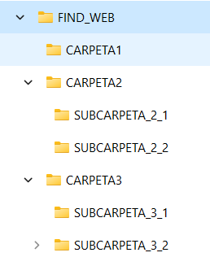
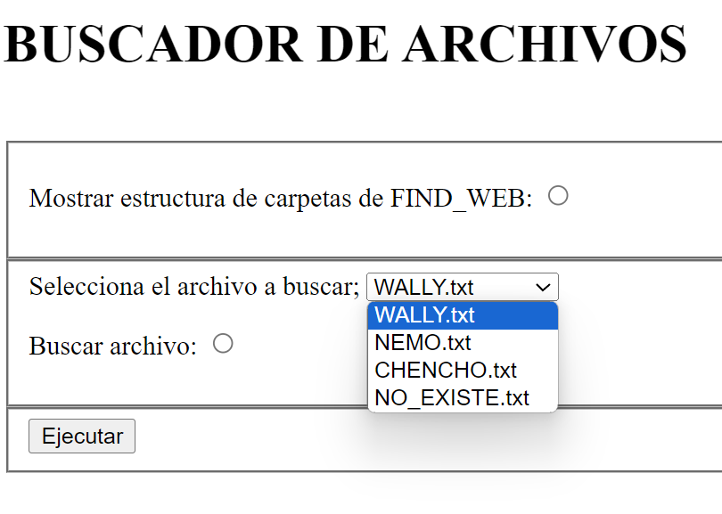
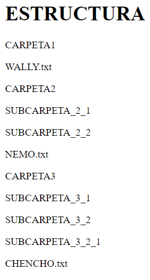
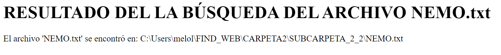

# FIND WEB: BUSCANDO A WALLY

1. Vas a crear un proyecto web que hará dos cosas:
   
    1.1. Mostrar la estructura de carpetas y archivos.
   
    1.2. Encontrar un archivo en una estructura de directorios. Debe hacerlo usando recursividad.

3. Descarga el zip y monta la estructura de carpetas en el directorio home del usuario.

Dentro de esta estructura hay ocultos tres archivos llamados:
- WALLY.txt
- NEMO.txt
- CHENCHO.txt

3. En la página index.html contendrá un formulario para permitir al usuario elegir la acción a realizar:

4. Dicho Servlet devolverá una página HTML dependiendo de la acción elegida:

